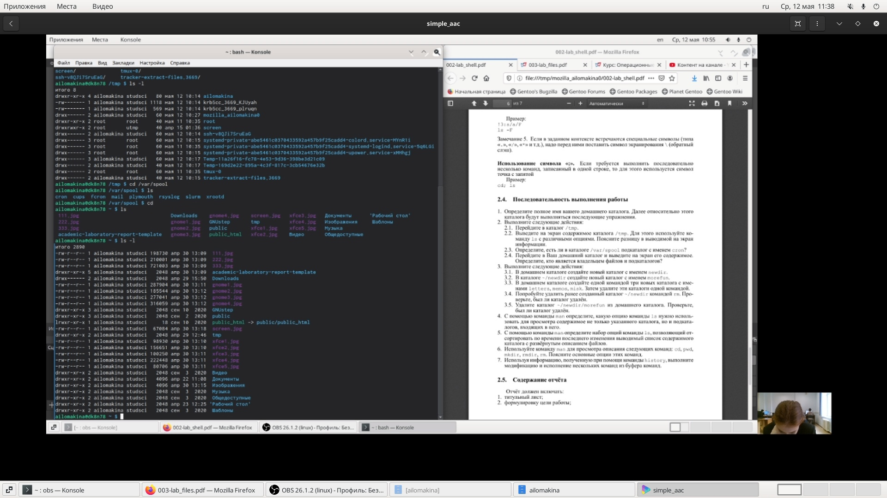
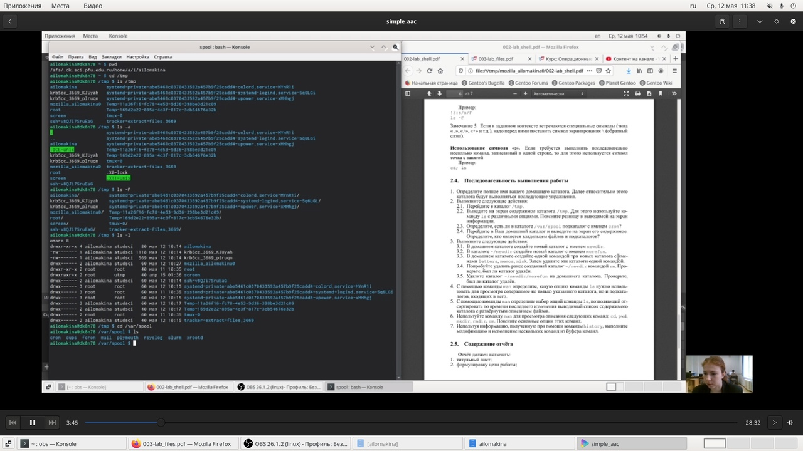
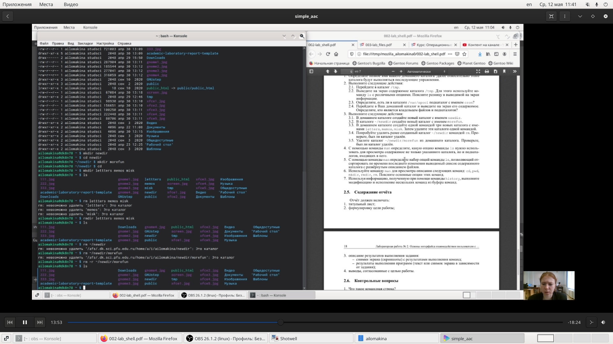
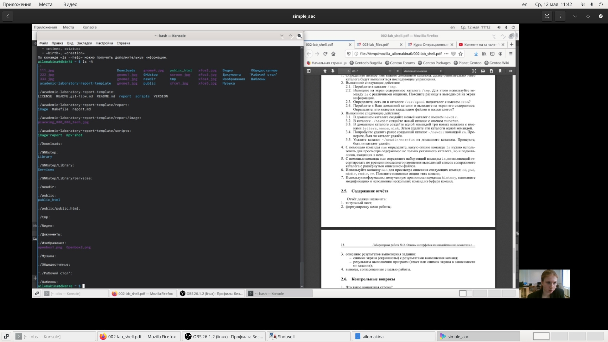
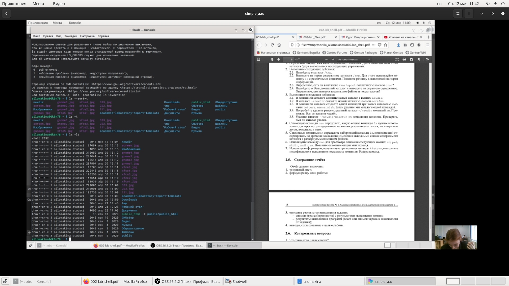
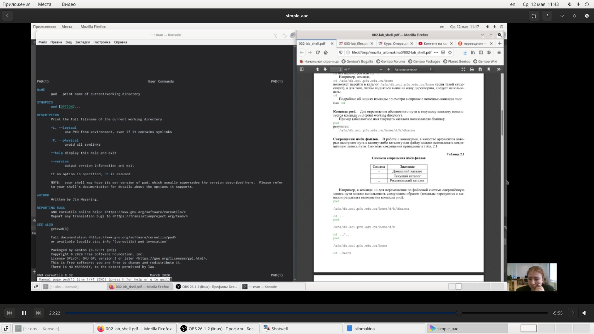
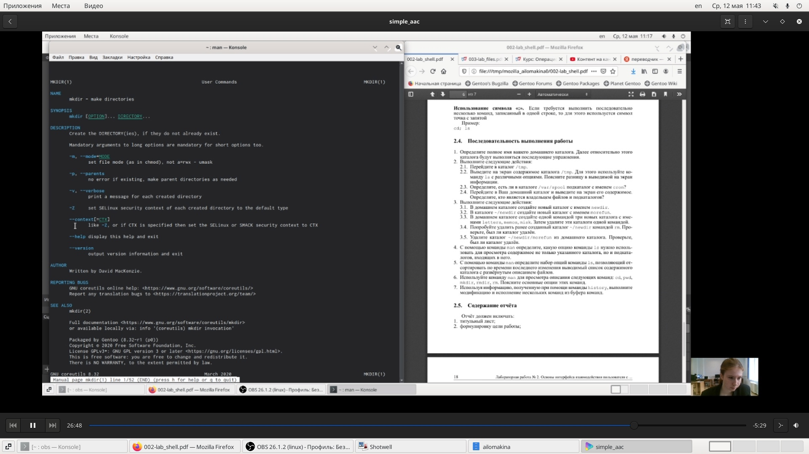
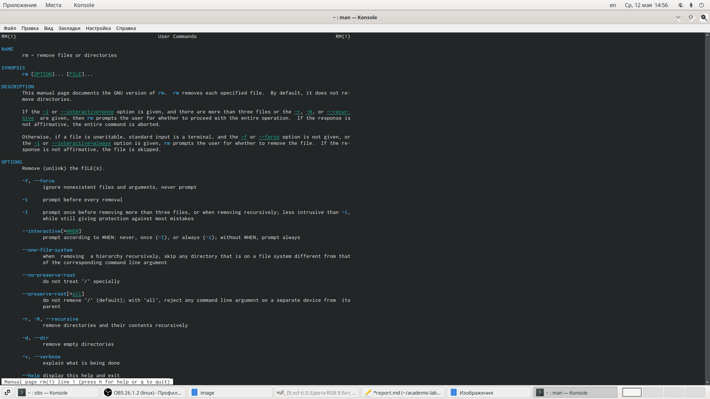
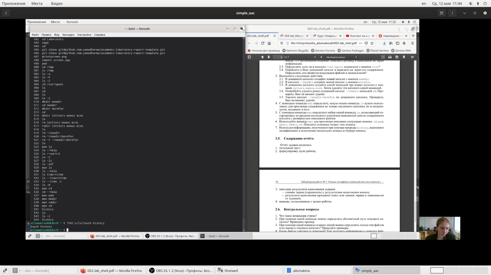

---
## Front matter
lang: ru-RU
title: Structural approach to the deep learning method
author: |
	Lomakina Anna Ivanovna\inst{1}
institute: |
	\inst{1}RUDN University, Moscow, Russian Federation
date: May--2021, 12 May -- 13 May, 2021 Moscow

## Formatting
toc: false
slide_level: 2
theme: metropolis
header-includes: 
 - \metroset{progressbar=frametitle,sectionpage=progressbar,numbering=fraction}
 - '\makeatletter'
 - '\beamer@ignorenonframefalse'
 - '\makeatother'
aspectratio: 43
section-titles: true
---
# Цель работы
Приобретение практических навыков взаимодействия пользователя с системой посредством командной строки. 

# Задание
Определите полное имя вашего домашнего каталога. Далее относительно этого каталога будут выполняться последующие упражнения. 
Выполните следующие действия:
  
Перейдите в каталог /tmp.
Выведите на экран содержимое каталога /tmp. Для этого используйте команду ls с различными опциями. Поясните разницу в выводимой на экран информации.
Определите, есть ли в каталоге /var/spool подкаталог с именем cron? 
Перейдите в Ваш домашний каталог и выведите на экран его содержимое. Определите, кто является владельцем файлов и подкаталогов?
Выполните следующие действия:
В домашнем каталоге создайте новый каталог с именем newdir.
В каталоге ~/newdir создайте новый каталог с именем morefun. 

## Часть 1.2

 В домашнем каталоге создайте одной командой три новых каталога с именами letters, memos, misk. Затем удалите эти каталоги одной командой.
 
 Попробуйте удалить ранее созданный каталог ~/newdir командой rm. Проверьте, был ли каталог удалён.
 
 Удалите каталог ~/newdir/morefun из домашнего каталога. Проверьте, был ли каталог удалён. 
 
С помощью команды man определите, какую опцию команды ls нужно использовать для просмотра содержимое не только указанного каталога, но и подкаталогов, входящих в него. 
С помощью команды man определите набор опций команды ls, позволяющий отсортировать по времени последнего изменения выводимый список содержимого каталога с развёрнутым описанием файлов. 
Используйте команду man для просмотра описания следующих команд: cd, pwd, mkdir, rmdir, rm. Поясните основные опции этих команд. 
Используя информацию, полученную при помощи команды history, выполните модификацию и исполнение нескольких команд из буфера команд. 

# Выполнение лабораторной работы
- Я определила полное имя своего домашнего каталога. 
Выполнила следующие действия: 
- Перешла в каталог /tmp. 
- Вывела на экран содержимое каталога /tmp. Для этого использовала команду ls с различными опциями. 
Команда ls используется для просмотра содержимого каталога. 

## Часть 3

Команда ls -a  используется для того,чтобы отобразить имена скрытых файлов 
Команда ls - F используется для того,чтобы получить информацию о типах файлов (в поле имени выводится символ, который определяет тип файла) 
Команда ls - l используется для того,чтобы вывести на экран подробную информацию о файлах и каталогах. 
- Определила, что в каталоге /var/spool есть подкаталог с именем cron. 

## Часть 4

- Перешла в домашний каталог и вывела на экран его содержимое.Определила,что я являюсь владельцем файлов и подкаталогов. 

{ #fig:001 width=35% }
{ #fig:001 width=35% }

 Выполнила следующие действия:
- В домашнем каталоге создала новый каталог с именем newdir,В каталоге ~/newdir создала новый каталог с именем morefun.
- В домашнем каталоге создала одной командой три новых каталога с именами letters, memos, misk. Затем удалила эти каталоги одной командой. 

## Часть 5

- Попробовала удалить ранее созданный каталог ~/newdir командой rm. Каталог не был удален. 

{ #fig:001 width=50% }

- Удалила каталог командой  rm –r. 
 С помощью команды man определила, какую опцию команды ls нужно использовать для просмотра содержимого не только указанного каталога, но и подкаталогов, входящих в него. 
Ls –R
 
{ #fig:001 width=50% }

## Часть 6

- С помощью команды man определила набор опций команды ls, позволяющий отсортировать по времени последнего изменения выводимый список содержимого каталога с развёрнутым описанием файлов. 
Ls –lt 
Ls --time=ctime 
Ls –sort=t 

{ #fig:001 width=50% }

## Часть 7

- Использовала команду man для просмотра описания следующих команд: cd, pwd, mkdir, rmdir, rm. Поясните основные опции этих команд. 

{ #fig:001 width=50% }

{ #fig:001 width=50% }

{ #fig:001 width=50% }

{ #fig:001 width=50% }

{ #fig:001 width=50% }

## Часть 8

- Используя информацию, полученную при помощи команды history, выполнила модификацию и исполнение нескольких команд из буфера команд.

{ #fig:001 width=50% }

# Вывод

Я приобрела практические навыки взаимодействия пользователя с системой посредством командной строки.

## {.standout}

Спасибо за внимание!!!!
