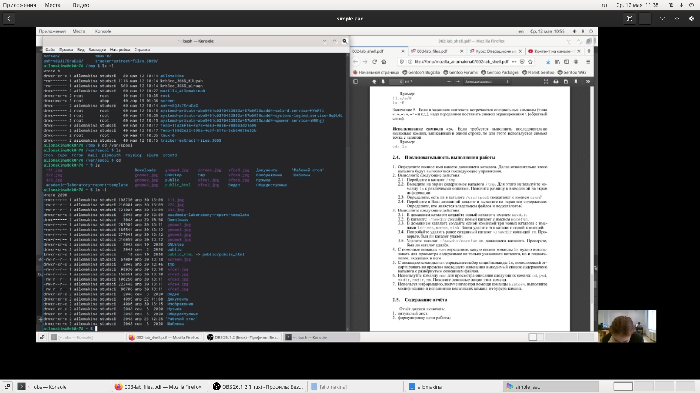
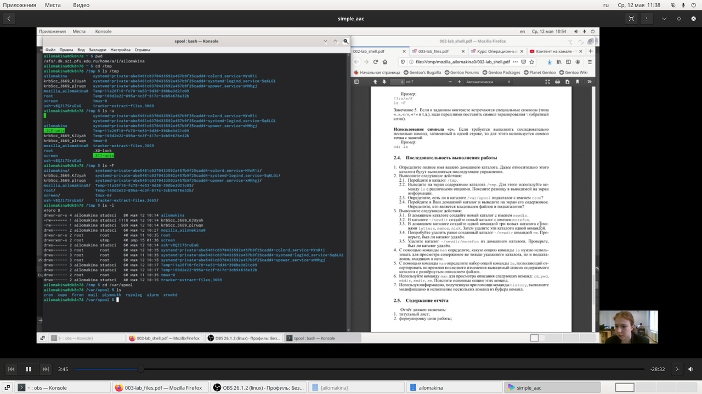
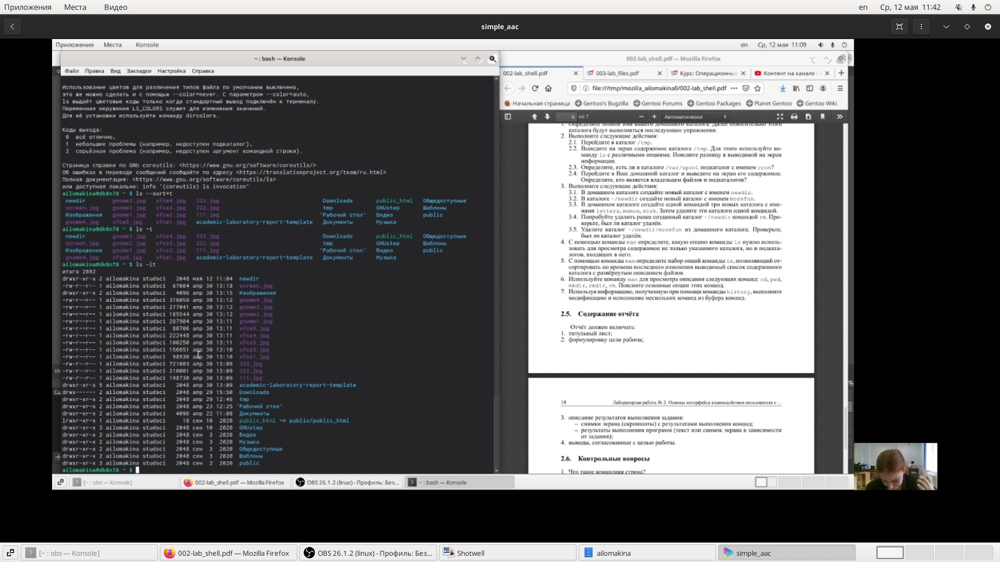
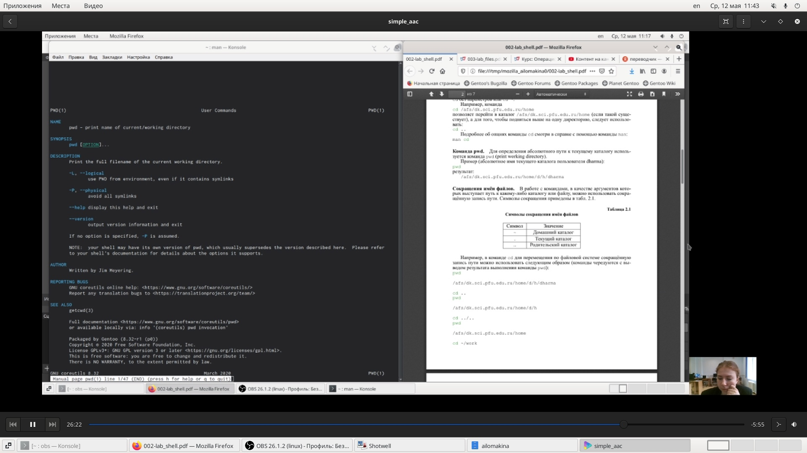
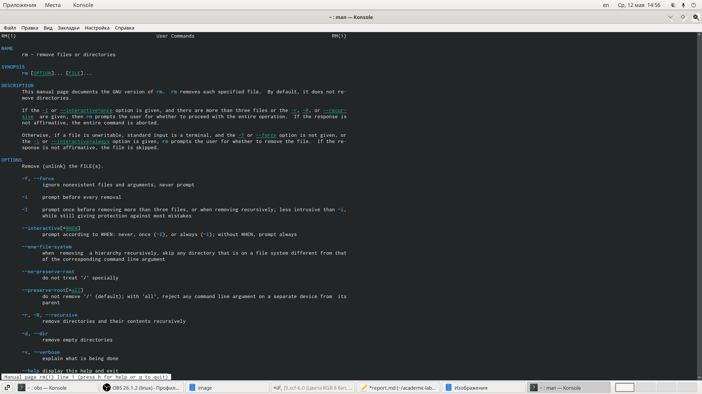

---
# Front matter
lang: ru-RU
title: "Отчёт по лабораторной работе №5"
subtitle: "Анализ файловой системы Linux.Команды для работы с файлами и каталогами"
author: "Ломакина Анна Ивановна"

# Formatting
toc-title: "Содержание"
toc: true # Table of contents
toc_depth: 2
lof: true # List of figures
lot: true # List of tables
fontsize: 12pt
linestretch: 1.5
papersize: a4paper
documentclass: scrreprt
polyglossia-lang: russian
polyglossia-otherlangs: english
mainfont: PT Serif
romanfont: PT Serif
sansfont: PT Sans
monofont: PT Mono
mainfontoptions: Ligatures=TeX
romanfontoptions: Ligatures=TeX
sansfontoptions: Ligatures=TeX,Scale=MatchLowercase
monofontoptions: Scale=MatchLowercase
indent: true
pdf-engine: lualatex
header-includes:
  - \linepenalty=10 # the penalty added to the badness of each line within a paragraph (no associated penalty node) Increasing the value makes tex try to have fewer lines in the paragraph.
  - \interlinepenalty=0 # value of the penalty (node) added after each line of a paragraph.
  - \hyphenpenalty=50 # the penalty for line breaking at an automatically inserted hyphen
  - \exhyphenpenalty=50 # the penalty for line breaking at an explicit hyphen
  - \binoppenalty=700 # the penalty for breaking a line at a binary operator
  - \relpenalty=500 # the penalty for breaking a line at a relation
  - \clubpenalty=150 # extra penalty for breaking after first line of a paragraph
  - \widowpenalty=150 # extra penalty for breaking before last line of a paragraph
  - \displaywidowpenalty=50 # extra penalty for breaking before last line before a display math
  - \brokenpenalty=100 # extra penalty for page breaking after a hyphenated line
  - \predisplaypenalty=10000 # penalty for breaking before a display
  - \postdisplaypenalty=0 # penalty for breaking after a display
  - \floatingpenalty = 20000 # penalty for splitting an insertion (can only be split footnote in standard LaTeX)
  - \raggedbottom # or \flushbottom
  - \usepackage{float} # keep figures where there are in the text
  - \floatplacement{figure}{H} # keep figures where there are in the text
---

# Цель работы
Приобретение практических навыков взаимодействия пользователя с системой посредством командной строки. 

# Задание
 
Определите полное имя вашего домашнего каталога. Далее относительно этого каталога будут выполняться последующие упражнения. 

- Выполните следующие действия: 

- Перейдите в каталог /tmp.

- Выведите на экран содержимое каталога /tmp. Для этого используйте команду ls с различными опциями. Поясните разницу в выводимой на экран информации.

- Определите, есть ли в каталоге /var/spool подкаталог с именем cron? 

- Перейдите в Ваш домашний каталог и выведите на экран его содержимое. Определите, кто является владельцем файлов и подкаталогов?

Выполните следующие действия:

- В домашнем каталоге создайте новый каталог с именем newdir.

- В каталоге ~/newdir создайте новый каталог с именем morefun. 

- В домашнем каталоге создайте одной командой три новых каталога с именами letters, memos, misk. Затем удалите эти каталоги одной командой.

- Попробуйте удалить ранее созданный каталог ~/newdir командой rm. Проверьте, был ли каталог удалён.

- Удалите каталог ~/newdir/morefun из домашнего каталога. Проверьте, был ли каталог удалён. 

С помощью команды man определите, какую опцию команды ls нужно использовать для просмотра содержимое не только указанного каталога, но и подкаталогов, входящих в него. 

С помощью команды man определите набор опций команды ls, позволяющий отсортировать по времени последнего изменения выводимый список содержимого каталога с развёрнутым описанием файлов. 

Используйте команду man для просмотра описания следующих команд: cd, pwd, mkdir, rmdir, rm. Поясните основные опции этих команд. 

Используя информацию, полученную при помощи команды history, выполните модификацию и исполнение нескольких команд из буфера команд. 

# Выполнение лабораторной работы
 

 

Ход работы: 

Я определила полное имя своего домашнего каталога. 

Выполнила следующие действия: 

- Перешла в каталог /tmp. 

- Вывела на экран содержимое каталога /tmp. Для этого использовала команду ls с различными опциями. 

Команда ls используется для просмотра содержимого каталога. 

Команда ls -a  используется для того,чтобы отобразить имена скрытых файлов 

Команда ls - F используется для того,чтобы получить информацию о типах файлов (в поле имени выводится символ, который определяет тип файла) 

Команда ls - l используется для того,чтобы вывести на экран подробную информацию о файлах и каталогах. 

- Определила, что в каталоге /var/spool есть подкаталог с именем cron. 

- Перешла в домашний каталог и вывела на экран его содержимое.Определила,что я являюсь владельцем файлов и подкаталогов. 

{ #fig:001 width=35% }
{ #fig:001 width=35% }

 Выполнила следующие действия:

- В домашнем каталоге создала новый каталог с именем newdir.

- В каталоге ~/newdir создала новый каталог с именем morefun.

- В домашнем каталоге создала одной командой три новых каталога с именами letters, memos, misk. Затем удалила эти каталоги одной командой. 

- Попробовала удалить ранее созданный каталог ~/newdir командой rm. Каталог не был удален. 

{ #fig:001 width=70% }

- Удалила каталог командой  rm –r. 

 С помощью команды man определила, какую опцию команды ls нужно использовать для просмотра содержимого не только указанного каталога, но и подкаталогов, входящих в него. 

Ls –R 

{ #fig:001 width=70% }

- С помощью команды man определила набор опций команды ls, позволяющий отсортировать по времени последнего изменения выводимый список содержимого каталога с развёрнутым описанием файлов. 

Ls –lt 

Ls --time=ctime 

Ls –sort=t 

{ #fig:001 width=70% }

- Использовала команду man для просмотра описания следующих команд: cd, pwd, mkdir, rmdir, rm. Поясните основные опции этих команд. 

{ #fig:001 width=50% }
{ #fig:001 width=50% }
{ #fig:001 width=50% }
{ #fig:001 width=50% }
{ #fig:001 width=50% }

- Используя информацию, полученную при помощи команды history, выполнила модификацию и исполнение нескольких команд из буфера команд.

{ #fig:001 width=50% }

#Контрольные вопросы  

1. Что такое командная строка? 

В операционной системе типа Linux взаимодействие пользователя с системой обычно осуществляется с помощью командной строки посредством построчного ввода команд. 

2. При помощи какой команды можно определить абсолютный путь текущего каталога? Приведите пример. 

Для определения абсолютного пути к текущему каталогу используется команда pwd (print working directory).

Пример (абсолютное имя текущего каталога пользователя dharma): 

pwd

результат: 

 /afs/dk.sci.pfu.edu.ru/home/d/h/dharma 

3. При помощи какой команды и каких опций можно определить только тип файлов и их имена в текущем каталоге? Приведите примеры. 

Команда ls используется для просмотра содержимого каталога.Можно получить информацию о типах файлов (каталог, исполняемый файл, ссылка), для чего используется опция F. При использовании этой опции в поле имени выводится символ, который определяет тип файла. 

Примеры: 

Public_html@ 

Downloads/ 

4. Какие файлы считаются скрытыми? Как получить информацию о скрытых файлах? Приведите примеры. 

Некоторые файлы в операционной системе скрыты от просмотра и обычно используются для настройки рабочей среды. Имена таких файлов начинаются с точки. Для того, чтобы отобразить имена скрытых файлов, необходимо использовать команду ls с опцией a: 

ls -a 

5. При помощи каких команд можно удалить файл и каталог? Можно ли это сделать одной и той же командой? Приведите примеры. 

Команда rm используется для удаления файлов и/или каталогов. 

Чтобы удалить каталог, содержащий файлы, нужно использовать опцию r. Без указания этой опции команда не будет выполняться. 

Если каталог пуст, то можно воспользоваться командой rmdir. Если удаляемый каталог содержит файлы, то команда не будет выполнена — нужно использовать rm –r. 

6. Как определить, какие команды выполнил пользователь в сеансе работы? 

Для вывода на экран списка ранее выполненных команд используется команда history. 

7. Каким образом можно исправить и запустить на выполнение команду, которую пользователь уже использовал в сеансе работы? Приведите примеры. 

Выводимые на экран команды в списке нумеруются. К любой команде из выведенного на экран списка можно обратиться по её номеру в списке, воспользовавшись конструкцией 

!<номер_команды>. 

Пример: 

history 

1 pwd 

2 ls 

3 ls -a 

4 ls -l 

5 cd / 

6 history ! 

5 cd / 

Можно модифицировать команду из выведенного на экран списка при помощи следующей конструкции: 

!<номер_команды>:s/<что_меняем>/<на_что_меняем> 

8. Можно ли в одной строке записать несколько команд? Если да, то как? Приведите примеры. 

Использование символа «;». 

Если требуется выполнить последовательно несколько команд, записанный в одной строке, то для этого используется символ точка с запятой 

Пример: cd; ls 

 9. Что такое символ экранирования? Приведите примеры использования этого символа. 

Если в заданном контексте встречаются специальные символы (типа «.», «/», «*» и т.д.), надо перед ними поставить символ экранирования \ (обратный слэш). 

!3:s/ cd\//F ls –F 

Когда мы использовали команду  cd/ то перед / поставили \. 

10. Какая информация выводится на экран о файлах и каталогах, если используется опция l в команде ls? 

Чтобы вывести на экран подробную информацию о файлах и каталогах, необходимо использовать опцию l. При этом о каждом файле и каталоге будет выведена следующая информация: 

– тип файла, 

– право доступа, 

– число ссылок, 

– владелец, 

– размер, 

– дата последней ревизии, 

– имя файла или каталога. 

11. Что такое относительный путь к файлу? Приведите примеры использования относительного и абсолютного пути при выполнении какой-либо команды. 

Относительный путь — так же как и полный путь, строится перечислением через / всех каталогов, но начинается от текущего каталога (каталога, в котором «находится» пользователь), т.е. пользователь, находясь в каталоге user, может обратиться к файлу addition.txt, указав относительный путь documents/addition.txt. 

Таким образом, в Linux если имя объекта начинается с /, то системой это интерпретируется как полный путь, в любом другом случае — как относительный. 

12. Как получить информацию об интересующей вас команде? 

Команда man используется для просмотра (оперативная помощь) в диалоговом режиме руководства (manual) по основным командам операционной системы типа Linux. Формат команды: man <команда> 

13. Какая клавиша или комбинация клавиш служит для автоматического дополнения вводимых команд? 

Автодополнение с помощью клавиши Tab 

Tab: автоматически завершает ввод имени файла, имени каталога или команды. 

# Выводы

Я приобрела практические навыки взаимодействия пользователя с системой посредством командной строки.
